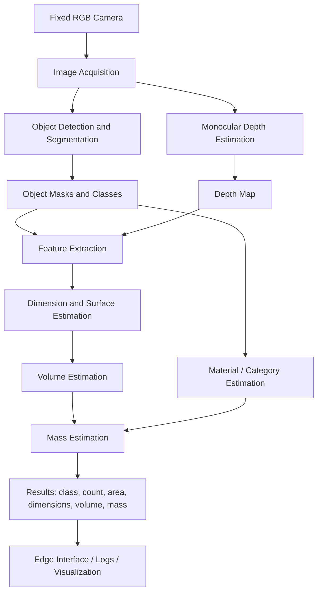

# Full Project Overview — Edge AI Waste Characterization and Mass Estimation

> **Source policy:** This overview is based only on the three provided project documents:  
> **S1.** *Edge AI for Waste Characterization: A Low-Cost Real-Time Solution Using Jetson Nano for Object Detection, Depth Estimation and Mass Estimation*  
> **S2.** *Edge AI System for Waste Object Analysis Using Fixed-Camera Image Processing*  
> **S3.** *Waste Object Characterization and Mass Estimation: Methods and Implementation*  
>
> No external web sources were used in this file.

---

## 1. Project Identity

| Item | Description |
|---|---|
| **Project domain** | Edge Artificial Intelligence, computer vision, waste management, smart recycling, object characterization, volume and mass estimation. |
| **Main title idea** | Development of a low-cost Edge AI system for waste object characterization and mass estimation using NVIDIA Jetson Nano and RGB camera. |
| **Main objective** | Build an offline, real-time, low-cost AI system capable of analyzing waste objects from camera images and estimating their material, quantity, dimensions, surface area, volume, and approximate mass. |
| **Target hardware** | NVIDIA Jetson Nano 4GB with RGB USB camera; optional alternatives include stereo/depth cameras such as OAK-D Lite or Intel RealSense for higher depth accuracy. |
| **Target environment** | Smart bins, recycling facilities, industrial IoT environments, sorting stations, or fixed-camera waste analysis setups. |
| **Main AI tasks** | Object detection, instance segmentation, material classification, monocular depth estimation, feature extraction, volume estimation, and mass estimation. |
| **Deployment philosophy** | Run inference locally at the edge without depending on cloud processing. |

---

## 2. General Problem

Waste sorting and waste measurement are important challenges in recycling, environmental monitoring, and industrial waste management. Traditional systems often depend on manual sorting or cloud-based image analysis. According to the provided documents, these approaches can be costly, slow, labor-intensive, and dependent on network connectivity.

The project proposes an **AI-at-the-edge** alternative: a fixed-camera system running on **Jetson Nano**, able to process images locally and estimate not only the object class, but also physical properties such as **surface area, approximate dimensions, volume, and mass**.

The difficulty is that mass is not directly visible in an image. Therefore, the system must infer mass indirectly by combining:

1. Object recognition and material estimation.
2. Segmentation masks.
3. Depth estimation.
4. Geometric features.
5. Density priors or regression models.

---

## 3. Project Motivation

| Motivation | Explanation |
|---|---|
| **Reduce manual labor** | Automated characterization can reduce the need for human inspection and manual estimation. |
| **Improve recycling decisions** | Knowing material type, object count, and approximate mass can support better sorting and monitoring. |
| **Enable low-cost deployment** | RGB cameras and Jetson Nano are cheaper than full industrial RGB-D or LiDAR systems. |
| **Support offline operation** | Local inference avoids dependency on cloud services and network connectivity. |
| **Allow real-time analysis** | The system aims to process images or camera streams fast enough for practical use. |
| **Improve industrial IoT integration** | The system can be part of smart bins, edge sorting stations, or monitoring dashboards. |

---

## 4. Core Research Gap

The three provided documents show that existing waste AI work often focuses mainly on **classification, detection, or segmentation**. However, mass estimation requires additional physical information that most public waste datasets do not provide, such as:

- Real object dimensions.
- Volume.
- Weight/mass labels.
- Material density.
- Calibration references.

Therefore, the project gap can be stated as:

> Existing waste recognition systems can classify or detect waste objects, but fewer low-cost systems combine segmentation, monocular depth estimation, calibrated dimension extraction, and mass estimation on edge hardware such as Jetson Nano.

This project tries to fill that gap by combining **vision-based recognition**, **monocular depth**, **geometry**, and **mass prediction** into one deployable Edge AI pipeline.

---

## 5. High-Level System Overview

The proposed system follows this general flow:



---

## 6. Main System Components

| Component | Role | Suggested tools/models from the documents |
|---|---|---|
| **Image acquisition** | Capture images or frames from a fixed camera. | USB RGB camera, optional stereo camera, OpenCV. |
| **Object detection** | Locate waste objects in the image. | YOLOv8, YOLOv9, SSD, Faster R-CNN in literature; YOLOv8-n/YOLOv8-seg is preferred for edge practicality. |
| **Instance segmentation** | Extract object mask for each detected item. | YOLOv8-seg, Mask R-CNN, SAM as a possible segmentation support tool. |
| **Depth estimation** | Infer depth map from RGB image. | Depth Anything, MiDaS, ZoeDepth mentioned as relevant approaches. |
| **Calibration and scaling** | Convert pixels/depth outputs into approximate real-world dimensions. | ArUco marker, checkerboard calibration, known object/reference scaling. |
| **Feature extraction** | Extract geometric and visual features from masks and depth. | Bounding box dimensions, mask area, convex hull area, perimeter, depth mean/min/max, texture features. |
| **Material recognition** | Estimate material class such as plastic, glass, metal, paper, cardboard, organic. | CNN, Vision Transformer, class-based material mapping, optional material dataset fine-tuning. |
| **Volume estimation** | Estimate object volume from geometry and depth. | 3D reconstruction, depth integration, shape approximation, fallback area × height prior. |
| **Mass estimation** | Predict approximate mass from volume, density, and learned features. | Density-based method, regression model, hybrid physics + ML method. |
| **Edge optimization** | Make the system run efficiently on Jetson Nano. | TensorRT, FP16/INT8 quantization, pruning, mixed precision, asynchronous pipeline. |
| **Evaluation** | Measure AI accuracy and system performance. | mAP, IoU, RMSE, MAE, MAPE, R², FPS, latency, memory, power. |

---

## 7. Input and Output Definition

### 7.1 System Inputs

| Input | Description | Why it matters |
|---|---|---|
| **RGB image/frame** | Main image captured by the fixed camera. | Base input for detection, segmentation, and depth estimation. |
| **Camera calibration data** | Intrinsic/extrinsic parameters or real-world scaling reference. | Required to convert image measurements into real dimensions. |
| **Depth map** | Predicted by monocular depth model. | Used to estimate 3D shape, dimensions, and volume. |
| **Segmentation mask** | Pixel-level region of each object. | Used to isolate the object for area, contour, and depth integration. |
| **Object category/material** | Predicted class such as plastic bottle, metal can, paper, cardboard. | Used to choose density priors or category embeddings. |
| **Density table or learned mass data** | Average density values or trained regression targets. | Used for mass estimation. |

### 7.2 System Outputs

| Output | Description |
|---|---|
| **Object class/material** | Predicted waste type or material group. |
| **Object count** | Number of distinct detected objects. |
| **Segmentation mask** | Object shape in the image. |
| **Surface area** | Visible area or calibrated approximate area. |
| **Approximate dimensions** | Width, height, and possibly thickness/depth-derived height. |
| **Estimated volume** | Approximate occupied volume from depth/geometric reconstruction. |
| **Estimated mass** | Approximate weight/mass using density, regression, or hybrid method. |
| **Performance indicators** | FPS, latency, memory use, and model confidence. |

---

## 8. Literature/Technical Foundation from the Documents

The three documents divide the project foundation into several technical areas:

| Area | What the documents say |
|---|---|
| **Waste recognition** | Waste recognition can be classification, detection, or segmentation. Detection and segmentation are more suitable when multiple objects appear in one scene. |
| **Datasets** | TrashNet and TACO are common public datasets. TrashNet is small and classification-focused; TACO provides richer real-world annotations but has imbalance and complexity. |
| **Depth estimation** | Depth Anything and MiDaS are used to estimate dense depth from RGB images. Depth is needed for dimensions, volume, and mass estimation. |
| **Volume estimation** | Can use 2D proxies, stereo/RGB-D depth, monocular depth, shape approximation, or depth integration. |
| **Mass estimation** | Can be density-based, regression-based, or hybrid. Direct image-to-mass regression is possible but requires representative training data. |
| **Sensor fusion** | Weight sensors, acoustic sensors, infrared, RGB-D, or stereo cameras can improve reliability, but increase cost/complexity. |
| **Edge deployment** | Jetson Nano is low-cost but limited; model choice and optimization are important. |
| **Evaluation** | Different stages require different metrics: mAP for detection, IoU for segmentation, RMSE/relative error for depth, MAE/RMSE/MAPE/R² for mass, and FPS/latency for deployment. |

---

## 9. Dataset Strategy

The provided documents suggest that existing public datasets are useful but insufficient for complete mass estimation. The reason is that mass estimation requires physical ground truth such as weight and dimensions, which most waste recognition datasets do not include.

### 9.1 Public Dataset Use

| Dataset | Role in project | Limitation |
|---|---|---|
| **TrashNet** | Useful for initial waste classification. | Small dataset, few classes, lab-like conditions, limited suitability for segmentation/mass. |
| **TACO** | Useful for litter detection/segmentation in realistic contexts. | Complex scenes, class imbalance, not directly designed for mass estimation. |
| **AquaTrash / Roboflow-style datasets** | Can support generalization to additional waste environments. | May differ strongly from the target fixed-camera setup. |

### 9.2 Custom Dataset Need

A custom dataset is recommended because the system must evaluate physical estimation. The custom dataset should include:

| Required data | Purpose |
|---|---|
| RGB image | Main visual input. |
| Bounding box | Detection training/evaluation. |
| Segmentation mask | Area, shape, and depth isolation. |
| Real dimensions | Calibration and dimension evaluation. |
| Weight/mass | Ground truth for mass regression. |
| Material/category label | Density selection and category embedding. |
| Camera setup metadata | Required for reproducibility and scaling. |

### 9.3 Suggested Categories

The documents suggest using broad waste categories or TACO-style super-categories. A practical simplified taxonomy could include:

- Plastic bottle.
- Rigid plastic.
- Thin plastic/bag.
- Paper.
- Cardboard.
- Glass.
- Metal can.
- Organic waste.
- Other/unknown.

---

## 10. Model Strategy

### 10.1 Detection and Segmentation

The documents emphasize lightweight models for edge deployment. The proposed direction is:

| Candidate model | Role | Notes |
|---|---|---|
| **YOLOv8-n / YOLOv8-n-seg** | Main detection/segmentation candidate. | Good balance between speed and accuracy for Jetson Nano. |
| **YOLOv9** | Comparative model. | Can be compared experimentally, but must be tested under edge constraints. |
| **SSD / MobileNetV3-SSD** | Lightweight fallback. | Faster and smaller, but may be less accurate. |
| **Mask R-CNN** | Literature baseline. | Strong segmentation but heavier for Jetson Nano. |
| **SAM** | Annotation/segmentation support. | Useful for masks or open-world segmentation assistance, but heavy for edge deployment. |

### 10.2 Depth Estimation

| Model | Role | Notes |
|---|---|---|
| **Depth Anything** | Main depth estimation candidate. | Proposed because of strong generalization and dense depth output. |
| **MiDaS** | Baseline/comparison. | Produces relative depth and needs scaling/calibration. |
| **ZoeDepth / metric depth models** | Possible comparison. | Mentioned as part of monocular metric depth literature. |

### 10.3 Material Recognition

Material can be estimated in two ways:

1. **Class-to-material mapping**: if the detector predicts “plastic bottle,” the material is mapped to plastic/PET.
2. **Dedicated material classifier**: lightweight CNN or ViT model predicts material type from the object crop.

The first method is simpler and practical. The second method may be more flexible but requires more labeled material data.

### 10.4 Mass Estimation Model

| Approach | Description | Strength | Weakness |
|---|---|---|---|
| **Density-based** | Estimate mass as volume × density. | Simple, explainable, physically grounded. | Fails with hollow, crushed, deformed, or mixed-material objects. |
| **Regression-based** | Train model to predict mass from features. | Learns complex relations and correction factors. | Needs ground-truth weight dataset. |
| **Hybrid** | Use density-based estimate plus learned correction. | Best balance between physics and data-driven learning. | More complex pipeline and requires validation. |

---

## 11. Proposed Full Methodology

The project methodology can be organized into the following stages.

### Stage 1 — Camera Setup and Calibration

| Step | Description |
|---|---|
| Mount fixed camera | Place the RGB camera in a stable position. |
| Define workspace | Use a fixed background/table/bin region. |
| Calibrate scale | Use ArUco marker, checkerboard, known camera height, or reference object. |
| Store calibration | Save camera/scaling parameters for inference and evaluation. |

### Stage 2 — Dataset Construction

| Step | Description |
|---|---|
| Collect images | Capture representative waste objects under controlled and semi-real conditions. |
| Annotate objects | Produce bounding boxes and segmentation masks. |
| Measure objects | Record real dimensions and weight using physical tools. |
| Split dataset | Train/validation/test split. |
| Augment data | Use shadows, rotations, occlusion, CutMix, background variation if needed. |

### Stage 3 — Object Detection and Segmentation

| Step | Description |
|---|---|
| Train YOLO segmentation model | Train or fine-tune YOLOv8-seg on waste masks. |
| Validate detection | Use mAP, precision, recall. |
| Validate segmentation | Use mask IoU or mask mAP. |
| Export model | Convert to ONNX/TensorRT if needed for Jetson deployment. |

### Stage 4 — Depth Estimation

| Step | Description |
|---|---|
| Run depth model | Generate depth map using Depth Anything or MiDaS. |
| Align with mask | Extract depth values only inside each object mask. |
| Apply scaling | Convert relative depth to approximate metric scale using calibration. |
| Validate depth | Compare estimated distances/heights with real measurements. |

### Stage 5 — Feature Extraction

| Feature type | Examples |
|---|---|
| 2D features | Mask area, bounding box width/height, contour perimeter, convex hull area. |
| Depth features | Mean depth, min depth, max depth, depth range, object-to-background difference. |
| 3D/geometric features | Estimated width, height, surface area, approximate volume. |
| Category features | Class ID, material group, category embedding. |
| Texture/appearance features | Optional LBP histogram, color statistics, image crop features. |

### Stage 6 — Volume Estimation

Possible methods:

| Method | Description |
|---|---|
| **Depth integration** | Use mask and depth difference from background plane to estimate object volume. |
| **3D bounding box** | Estimate dimensions and approximate the object as a box. |
| **Shape approximation** | Approximate bottles/cans as cylinders, boxes as cuboids, etc. |
| **Fallback method** | Use 2D area × category-specific height prior when depth fails. |

### Stage 7 — Mass Estimation

| Method | Formula/logic | Use case |
|---|---|---|
| **Density baseline** | `mass = density × volume` | First explainable baseline. |
| **Regression model** | `mass = f(features)` | Learns from measured weights. |
| **Hybrid model** | `mass = f(volume, density_estimate, features, category)` | Recommended for thesis because it combines physics and ML. |

### Stage 8 — Edge Deployment

| Step | Description |
|---|---|
| Prepare Jetson environment | Python, OpenCV, PyTorch, TensorRT, model files. |
| Optimize models | FP16/INT8 quantization, pruning, TensorRT conversion. |
| Build real-time pipeline | Use asynchronous capture, detection, depth, and post-processing where possible. |
| Add fallback modes | If depth fails, use simpler 2D/geometric priors. |
| Monitor performance | Measure FPS, latency, RAM, GPU usage, temperature, and power. |

---

## 12. System Architecture

### 12.1 Hardware Architecture

| Hardware | Role |
|---|---|
| **NVIDIA Jetson Nano 4GB** | Main edge inference device. |
| **RGB USB camera** | Captures waste images. |
| **Stable camera mount** | Ensures fixed camera geometry. |
| **Power supply and SD card** | Required Jetson setup components. |
| **Optional OAK-D Lite / RealSense** | Optional upgrade for native depth sensing and higher accuracy. |
| **Optional scale/load cell** | Optional sensor fusion for true weight measurement. |

### 12.2 Software Architecture

| Layer | Role | Possible tools |
|---|---|---|
| **Input layer** | Camera capture and calibration. | OpenCV. |
| **Recognition layer** | Detect and segment waste objects. | YOLOv8-seg, Ultralytics, PyTorch. |
| **Depth layer** | Generate depth maps. | Depth Anything, MiDaS. |
| **Post-processing layer** | Extract masks, contours, dimensions, depth stats. | Python, OpenCV, NumPy. |
| **Mass estimation layer** | Density/regression/hybrid model. | Scikit-learn, PyTorch MLP, custom formulas. |
| **Optimization layer** | Speed up inference. | TensorRT, ONNX, FP16/INT8. |
| **Interface layer** | Show or log results. | CLI, local dashboard, visualization output. |

---

## 13. Suggested Repository Structure

Based on the second document, the project repository can be organized as follows:

```text
edge-ai-waste-analysis/
├── data/
│   ├── raw/
│   ├── processed/
│   ├── annotations/
│   └── calibration/
├── configs/
│   ├── detection.yaml
│   ├── depth.yaml
│   ├── mass_regression.yaml
│   └── deployment.yaml
├── models/
│   ├── detection/
│   ├── depth/
│   └── mass/
├── notebooks/
│   ├── dataset_exploration.ipynb
│   ├── depth_experiments.ipynb
│   └── mass_estimation_experiments.ipynb
├── src/
│   ├── camera/
│   │   └── capture.py
│   ├── calibration/
│   │   └── scale_calibration.py
│   ├── detection/
│   │   └── yolo_inference.py
│   ├── depth/
│   │   └── depth_estimation.py
│   ├── features/
│   │   └── extract_features.py
│   ├── mass/
│   │   ├── density_estimator.py
│   │   ├── regression_model.py
│   │   └── hybrid_estimator.py
│   ├── evaluation/
│   │   ├── evaluate_detection.py
│   │   ├── evaluate_depth.py
│   │   └── evaluate_mass.py
│   └── main.py
├── scripts/
│   ├── train_detection.sh
│   ├── train_mass_model.sh
│   ├── export_tensorrt.sh
│   └── run_inference.sh
├── docs/
│   ├── architecture.md
│   ├── calibration.md
│   └── experiments.md
└── README.md
```

---

## 14. Evaluation Plan

### 14.1 Module-Level Evaluation

| Module | Evaluation question | Metrics |
|---|---|---|
| **Detection** | Does the system detect the correct objects? | Precision, recall, mAP@50, mAP@50-95. |
| **Segmentation** | Are object masks accurate? | IoU, mask mAP, qualitative mask inspection. |
| **Depth** | Are estimated depths close to real measurements? | Absolute error, relative error, RMSE. |
| **Dimensions** | Are estimated object sizes close to measured sizes? | cm error, percentage error. |
| **Volume** | Is estimated volume close to physical or reference volume? | percentage volume error. |
| **Mass** | Is predicted weight close to measured weight? | MAE, RMSE, MAPE, R². |
| **Edge performance** | Can the pipeline run in real time? | FPS, latency, memory, GPU usage, power, temperature. |

### 14.2 End-to-End Evaluation

The integrated system should be evaluated from camera input to final output:

1. Capture image.
2. Detect/segment object.
3. Estimate depth.
4. Extract features.
5. Estimate dimensions and volume.
6. Predict mass.
7. Measure latency and performance.

### 14.3 Robustness Tests

| Test condition | Purpose |
|---|---|
| Stable lighting | Baseline performance. |
| Shadows / lighting variation | Test real-world robustness. |
| Different object sizes | Evaluate scale handling. |
| Partially occluded objects | Test detection/segmentation degradation. |
| Deformed/crushed waste | Test mass estimation reliability. |
| Multiple objects | Test counting and separation. |
| Long runtime on Jetson | Check thermal throttling and stability. |

---

## 15. Expected Results Mentioned in the Documents

> These are expected or proposed targets from the documents, not confirmed final experimental results.

| Expected result | Meaning |
|---|---|
| **Real-time inference** | Target around 5 FPS or higher in one document; another document expects about 10–15 FPS on Jetson Nano. |
| **Offline operation** | The system should work without cloud dependency. |
| **Weight error target** | One document suggests less than 15% error for common waste items under stable conditions. |
| **Low-cost setup** | Proposed system cost under about €200 with Jetson Nano and RGB camera. |
| **Robust operation** | Expected under stable lighting, with limitations in clutter, occlusion, and monocular depth uncertainty. |

---

## 16. Main Challenges

| Challenge | Explanation | Possible response |
|---|---|---|
| **Mass is not visible** | RGB images do not directly reveal weight. | Use volume, material density, and regression. |
| **Monocular depth scale ambiguity** | A single RGB image gives uncertain absolute depth. | Use calibration markers, fixed camera setup, known background plane. |
| **Hollow objects** | Bottles, cans, boxes, and bags contain air. | Use effective density, object category, regression correction. |
| **Object deformation** | Waste can be crushed, folded, wet, or partially hidden. | Train on real examples; add deformation-aware features. |
| **Dataset limitation** | Public datasets rarely include mass and dimensions. | Build custom dataset with physical measurements. |
| **Edge hardware limits** | Jetson Nano has limited memory and compute. | Use lightweight models, TensorRT, quantization, async pipeline. |
| **Clutter and occlusion** | Multiple/overlapping objects reduce mask and depth quality. | Use segmentation, tracking, or restrict setup to few objects per frame. |
| **Lighting variation** | Shadows and reflections affect RGB/depth estimation. | Use controlled lighting and augmentation. |
| **Generalization** | Regression may fail on unseen categories. | Use broader classes, category embeddings, and fallback baselines. |

---

## 17. Recommended Thesis Contribution Framing

The project can be presented as a system-level AI contribution rather than only a model-training task.

### Main contributions

| Contribution | Description |
|---|---|
| **Integrated Edge AI pipeline** | Combines detection, segmentation, depth estimation, volume estimation, and mass prediction. |
| **Low-cost RGB-based approach** | Avoids expensive sensors by using monocular depth and calibration. |
| **Custom physical-feature dataset protocol** | Defines the need for masks, dimensions, weights, and material labels. |
| **Hybrid mass estimation method** | Combines physical density reasoning with machine learning regression. |
| **Jetson Nano deployment strategy** | Focuses on real-time edge inference with optimization. |
| **Evaluation framework** | Evaluates both AI accuracy and system performance. |

---

## 18. Recommended Project Scope for a Master Thesis

Because the full problem is complex, a realistic master thesis scope should focus on a controlled but meaningful setup.

| Scope decision | Recommended choice |
|---|---|
| **Scene setup** | Fixed camera, stable background/table/bin region. |
| **Objects per frame** | One to few objects per frame. |
| **Camera** | RGB camera only, with optional comparison to depth camera if available. |
| **Detection model** | YOLOv8-seg as main model; compare with at least one baseline if possible. |
| **Depth model** | Depth Anything as main model; MiDaS as optional baseline. |
| **Mass method** | Density baseline + regression/hybrid model if enough ground-truth data exists. |
| **Deployment** | Jetson Nano inference demo, even if training is done elsewhere. |
| **Evaluation** | Detection metrics, mass error, and edge latency/FPS. |

---

## 19. Suggested Chapter Mapping for the Thesis

| Thesis chapter | What to cover from this project |
|---|---|
| **Chapter 1 — General Introduction** | Waste management problem, need for low-cost edge AI, objectives, scope, contributions. |
| **Chapter 2 — Background and Literature Review** | Waste recognition, datasets, depth estimation, volume estimation, mass estimation, edge deployment. |
| **Chapter 3 — Proposed Methodology** | Full pipeline: camera, detection, segmentation, depth, feature extraction, volume, mass. |
| **Chapter 4 — System Design and Implementation** | Hardware/software architecture, repository, modules, calibration, Jetson deployment. |
| **Chapter 5 — Experiments and Results** | Dataset split, training results, depth/dimension/mass evaluation, latency/FPS. |
| **Chapter 6 — Discussion** | Interpret results, explain limitations, compare density vs regression, analyze failure cases. |
| **General Conclusion** | Summarize achievements, limitations, and future work. |

---

## 20. Suggested Research Questions

| Research question | Why it matters |
|---|---|
| Can a low-cost RGB camera and Jetson Nano characterize waste objects in real time? | Tests the edge deployment goal. |
| How effective is YOLO-based segmentation for isolating waste objects in the target setup? | Segmentation quality affects area, volume, and mass. |
| Can monocular depth estimation provide useful physical cues for volume estimation? | Depth is central to 3D reasoning without depth sensors. |
| Is density-based mass estimation sufficient for common waste objects? | Establishes a simple physics baseline. |
| Does a regression or hybrid model improve mass estimation compared with density alone? | Tests the AI contribution in the mass stage. |
| What is the trade-off between accuracy and speed on Jetson Nano? | Determines practical deployability. |

---

## 21. Project Pipeline Summary

| Stage | Input | Processing | Output |
|---|---|---|---|
| **1. Image acquisition** | Camera frame | Capture and preprocessing | RGB image |
| **2. Detection/segmentation** | RGB image | YOLOv8-seg inference | Class, box, mask |
| **3. Depth estimation** | RGB image | Depth Anything / MiDaS | Depth map |
| **4. Calibration/scaling** | Depth map + reference | Convert relative scale to approximate metric scale | Scaled depth/dimensions |
| **5. Feature extraction** | Mask + depth + class | Geometric and visual features | Feature vector |
| **6. Volume estimation** | Features + scaled depth | Depth integration or shape approximation | Estimated volume |
| **7. Mass estimation** | Volume + material + features | Density formula, regression, or hybrid model | Estimated mass |
| **8. Deployment/output** | Predictions | Visualization/logging/API | Final results + performance |

---

## 22. Important Mathematical Concepts

### 22.1 Density-Based Mass

```text
mass = density × volume
```

This is the most explainable baseline. It requires:

- Estimated volume.
- Material/category density.
- Correction for hollow/deformed objects if possible.

### 22.2 Regression-Based Mass

```text
mass = f(mask_area, bbox_width, bbox_height, convex_hull_area, depth_stats, volume, category)
```

A lightweight regression model can learn from measured training data.

### 22.3 Hybrid Mass

```text
mass = f(physical_mass_estimate, volume, density, category, depth_features, 2D_features)
```

This method treats density-based mass as one feature, then learns corrections from data.

---

## 23. Final Project Definition

The project can be defined as:

> A low-cost, offline Edge AI system for waste object characterization and approximate mass estimation. The system uses a fixed RGB camera and NVIDIA Jetson Nano to detect and segment waste objects, estimate depth using monocular depth models, compute geometric and volume-related features, and predict mass using density-based, regression-based, or hybrid methods. The project targets real-time operation in smart waste management, recycling, and industrial IoT environments.

---

## 24. Final Notes for Academic Writing

1. Present the system as a **pipeline**, not as isolated models.
2. Clearly separate **recognition**, **depth**, **volume**, and **mass** stages.
3. Treat monocular depth as an **estimated signal** that requires calibration, not as guaranteed true metric depth.
4. Use density-based mass as a **baseline**, not as the only final solution.
5. Use regression/hybrid mass estimation if ground-truth weights are available.
6. Evaluate each module separately before evaluating the full pipeline.
7. Always distinguish between **expected results** from the documents and **your actual experimental results**.
8. In the thesis, highlight the difficulty of hollow/deformed waste because it is one of the central reasons mass estimation is challenging.

